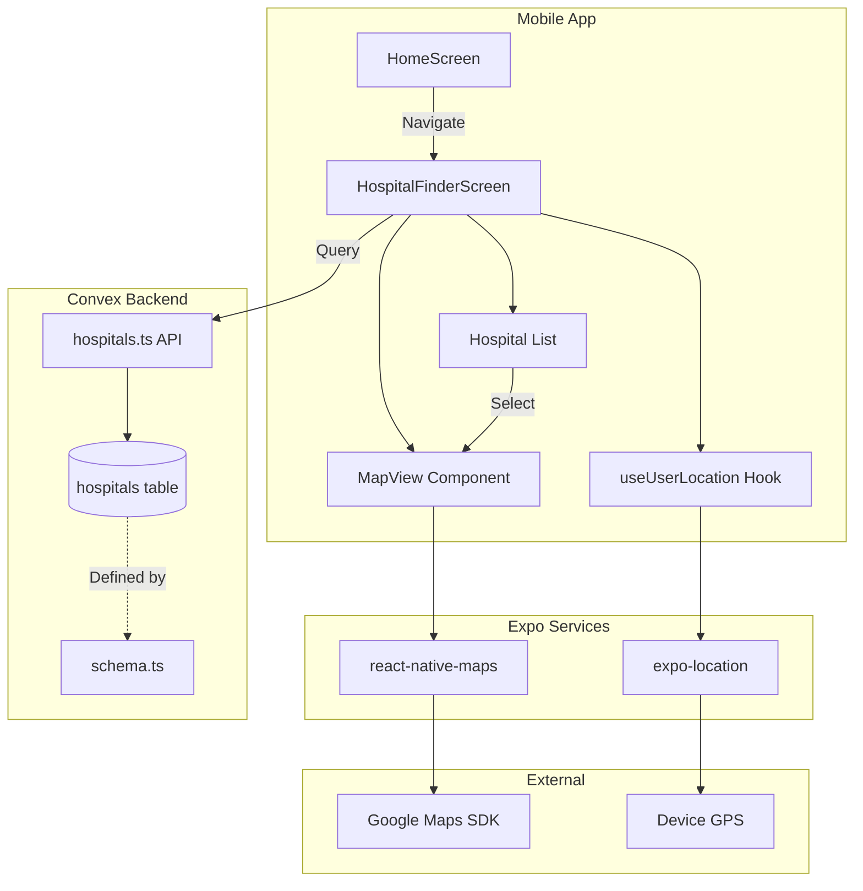
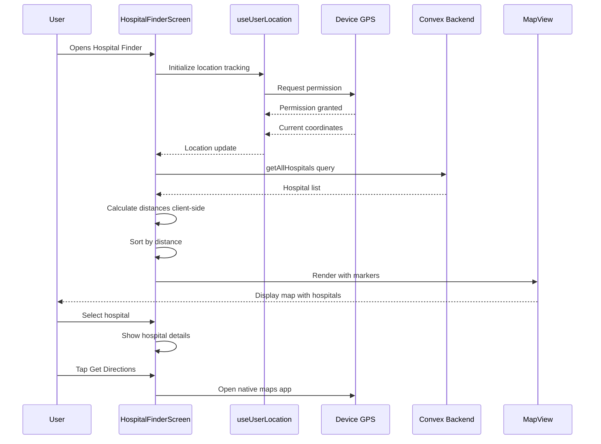

# Hospital Finder Module - Technical Architecture Document

## Table of Contents
1. [Overview](#overview)
2. [Map Library Selection](#map-library-selection)
3. [Required Dependencies](#required-dependencies)
4. [HospitalFinderScreen Design](#hospitalfinderscreen-design)
5. [Backend Design - Convex](#backend-design---convex)
6. [Navigation Integration](#navigation-integration)
7. [Homepage Button Design](#homepage-button-design)
8. [Data Source for Hospitals](#data-source-for-hospitals)
9. [System Architecture Diagram](#system-architecture-diagram)
10. [Implementation Checklist](#implementation-checklist)

---

## Overview

This document outlines the technical architecture for adding a Hospital Finder module to the BawaHealth React Native application. The module will:
- Track user GPS location in real-time
- Display nearby hospitals on an interactive map
- Allow users to search for hospitals
- Provide directions to selected hospitals

---

## Map Library Selection

### Analysis: Leaflet.js vs React Native Maps

| Criteria | Leaflet.js | react-native-maps |
|----------|------------|-------------------|
| Platform Support | Web only | Native iOS/Android |
| Performance | Slower via WebView | Native performance |
| GPS Integration | Manual via WebView bridge | Native integration |
| Offline Support | Limited | Good |
| Already Installed | No | **Yes** (v1.7.1) |

### Recommendation: `react-native-maps`

**Rationale:**
1. **Already installed** in the project (v1.7.1 in [`package.json`](package.json:41))
2. **Native performance** - Direct native bridge, no WebView overhead
3. **Seamless GPS integration** with `expo-location` (also already installed)
4. **Better UX** - Native map gestures, smoother animations
5. **Platform-appropriate** - Uses Google Maps on Android, Apple Maps on iOS

**Alternative Considered - WebView with Leaflet:**
- Would require `react-native-webview` as additional dependency
- Bridge communication overhead for GPS updates
- Not recommended for real-time location tracking

---

## Required Dependencies

### Already Installed ✅
```json
{
  "react-native-maps": "1.7.1",
  "expo-location": "~16.1.0"
}
```

### Additional Dependencies Required
```json
{
  "geolib": "^3.3.4"  // For Haversine distance calculations
}
```

### Configuration Required

#### Android - [`app.json`](app.json)
Add Google Maps API key configuration:
```json
{
  "expo": {
    "android": {
      "config": {
        "googleMaps": {
          "apiKey": "YOUR_GOOGLE_MAPS_API_KEY"
        }
      }
    }
  }
}
```

#### iOS - [`app.json`](app.json)
Add location permissions:
```json
{
  "expo": {
    "ios": {
      "infoPlist": {
        "NSLocationWhenInUseUsageDescription": "BawaHealth needs your location to find nearby hospitals.",
        "NSLocationAlwaysUsageDescription": "BawaHealth needs your location to find nearby hospitals."
      }
    }
  }
}
```

---

## HospitalFinderScreen Design

### Component Structure

```
HospitalFinderScreen/
├── HospitalFinderScreen.tsx    # Main screen component
├── components/
│   ├── HospitalMap.tsx         # Map with markers
│   ├── HospitalCard.tsx        # Hospital info card
│   ├── HospitalList.tsx        # Scrollable hospital list
│   ├── SearchBar.tsx           # Hospital search input
│   └── DirectionsButton.tsx    # Get directions CTA
└── hooks/
    └── useUserLocation.ts      # GPS tracking hook
```

### Screen Layout

```
┌─────────────────────────────────────┐
│           Header Bar                │
│  ← Back    Find Hospitals    🔍     │
├─────────────────────────────────────┤
│                                     │
│                                     │
│           MAP AREA                  │
│    (60% height)                     │
│    [User Location Pin]              │
│    [Hospital Markers]               │
│                                     │
├─────────────────────────────────────┤
│  Search: [________________] 🔍      │
├─────────────────────────────────────┤
│  ┌─────────────────────────────┐   │
│  │ 🏥 Hospital Name            │   │
│  │    1.2 km away              │   │
│  │    ⭐ 4.5 | Open 24h        │   │
│  │    [Get Directions]         │   │
│  └─────────────────────────────┘   │
│  ┌─────────────────────────────┐   │
│  │ 🏥 Another Hospital         │   │
│  │    2.4 km away              │   │
│  └─────────────────────────────┘   │
│         (Scrollable List)          │
└─────────────────────────────────────┘
```

### State Management

```typescript
interface HospitalFinderState {
  // Location state
  userLocation: {
    latitude: number;
    longitude: number;
  } | null;
  locationPermission: 'granted' | 'denied' | 'undetermined';
  locationError: string | null;
  
  // Hospital data
  hospitals: Hospital[];
  nearbyHospitals: Hospital[];
  selectedHospital: Hospital | null;
  
  // UI state
  isLoading: boolean;
  searchQuery: string;
  viewMode: 'map' | 'list';
  mapRegion: Region;
}
```

### GPS Tracking Implementation

```typescript
// hooks/useUserLocation.ts
import * as Location from 'expo-location';
import { useState, useEffect } from 'react';

export const useUserLocation = () => {
  const [location, setLocation] = useState<Location.LocationObject | null>(null);
  const [errorMsg, setErrorMsg] = useState<string | null>(null);
  const [permission, setPermission] = useState<'granted' | 'denied' | 'undetermined'>('undetermined');

  useEffect(() => {
    let subscription: Location.LocationSubscription;

    (async () => {
      // Request permission
      const { status } = await Location.requestForegroundPermissionsAsync();
      setPermission(status === 'granted' ? 'granted' : 'denied');
      
      if (status !== 'granted') {
        setErrorMsg('Permission to access location was denied');
        return;
      }

      // Get initial location
      const initialLocation = await Location.getCurrentPositionAsync({
        accuracy: Location.Accuracy.High,
      });
      setLocation(initialLocation);

      // Subscribe to location updates
      subscription = await Location.watchPositionAsync(
        {
          accuracy: Location.Accuracy.Balanced,
          distanceInterval: 100, // Update every 100 meters
          timeInterval: 10000,   // Or every 10 seconds
        },
        (newLocation) => {
          setLocation(newLocation);
        }
      );
    })();

    return () => {
      if (subscription) {
        subscription.remove();
      }
    };
  }, []);

  return { location, errorMsg, permission };
};
```

### Key Component: HospitalFinderScreen.tsx

```typescript
// Pseudo-code structure
import React, { useState, useEffect, useCallback } from 'react';
import { View, StyleSheet, Dimensions } from 'react-native';
import MapView, { Marker, PROVIDER_GOOGLE } from 'react-native-maps';
import { useUserLocation } from './hooks/useUserLocation';
import { convex } from '../convex/client';
import { api } from '../../convex/_generated/api';
import { calculateDistance } from '../utils/geo';

const HospitalFinderScreen = ({ navigation }) => {
  const { location, permission, errorMsg } = useUserLocation();
  const [hospitals, setHospitals] = useState([]);
  const [selectedHospital, setSelectedHospital] = useState(null);

  // Fetch hospitals when location available
  useEffect(() => {
    if (location) {
      fetchNearbyHospitals();
    }
  }, [location]);

  const fetchNearbyHospitals = async () => {
    const allHospitals = await convex.query(api.hospitals.getAllHospitals);
    // Calculate distances and sort
    const withDistances = allHospitals.map(hospital => ({
      ...hospital,
      distance: calculateDistance(
        location.coords.latitude,
        location.coords.longitude,
        hospital.latitude,
        hospital.longitude
      )
    }));
    withDistances.sort((a, b) => a.distance - b.distance);
    setHospitals(withDistances);
  };

  // Render map with markers
  // Render hospital list
  // Handle hospital selection
  // Open directions in native maps app
};
```

---

## Backend Design - Convex

### New Table: `hospitals`

Add to [`convex/schema.ts`](convex/schema.ts):

```typescript
hospitals: defineTable({
  // Basic Information
  name: v.string(),
  nameMs: v.optional(v.string()),        // Malay name
  type: v.union(
    v.literal("government"),
    v.literal("private"),
    v.literal("clinic"),
    v.literal("specialist")
  ),
  
  // Location
  latitude: v.number(),
  longitude: v.number(),
  address: v.string(),
  city: v.string(),
  state: v.string(),
  postalCode: v.string(),
  
  // Contact
  phoneNumber: v.string(),
  emergencyNumber: v.optional(v.string()),
  website: v.optional(v.string()),
  email: v.optional(v.string()),
  
  // Operating Hours
  operatingHours: v.object({
    monday: v.optional(v.string()),
    tuesday: v.optional(v.string()),
    wednesday: v.optional(v.string()),
    thursday: v.optional(v.string()),
    friday: v.optional(v.string()),
    saturday: v.optional(v.string()),
    sunday: v.optional(v.string()),
  }),
  is24Hours: v.boolean(),
  hasEmergency: v.boolean(),
  
  // Features
  specialties: v.optional(v.array(v.string())),
  facilities: v.optional(v.array(v.string())),
  
  // Metadata
  isActive: v.boolean(),
  createdAt: v.number(),
  updatedAt: v.number(),
})
  .index("by_state", ["state"])
  .index("by_city", ["city"])
  .index("by_type", ["type"])
  .index("by_active", ["isActive"]),
```

### New Convex Functions

Create [`convex/hospitals.ts`](convex/hospitals.ts):

```typescript
import { v } from "convex/values";
import { query, mutation, action } from "./_generated/server";

// Get all active hospitals
export const getAllHospitals = query({
  args: {},
  handler: async (ctx) => {
    return await ctx.db
      .query("hospitals")
      .withIndex("by_active", (q) => q.eq("isActive", true))
      .collect();
  },
});

// Get hospitals by state
export const getHospitalsByState = query({
  args: { state: v.string() },
  handler: async (ctx, args) => {
    return await ctx.db
      .query("hospitals")
      .withIndex("by_state", (q) => q.eq("state", args.state))
      .filter((q) => q.eq(q.field("isActive"), true))
      .collect();
  },
});

// Search hospitals by name
export const searchHospitals = query({
  args: { searchTerm: v.string() },
  handler: async (ctx, args) => {
    const hospitals = await ctx.db
      .query("hospitals")
      .filter((q) => q.eq(q.field("isActive"), true))
      .collect();
    
    const term = args.searchTerm.toLowerCase();
    return hospitals.filter(
      (h) =>
        h.name.toLowerCase().includes(term) ||
        h.city.toLowerCase().includes(term) ||
        (h.nameMs && h.nameMs.toLowerCase().includes(term))
    );
  },
});

// Get single hospital details
export const getHospital = query({
  args: { hospitalId: v.id("hospitals") },
  handler: async (ctx, args) => {
    return await ctx.db.get(args.hospitalId);
  },
});

// Get nearby hospitals (with bounding box pre-filter)
// Note: Fine distance calculation done client-side
export const getHospitalsInBoundingBox = query({
  args: {
    minLat: v.number(),
    maxLat: v.number(),
    minLng: v.number(),
    maxLng: v.number(),
  },
  handler: async (ctx, args) => {
    const hospitals = await ctx.db
      .query("hospitals")
      .filter((q) => q.eq(q.field("isActive"), true))
      .collect();
    
    // Filter by bounding box
    return hospitals.filter(
      (h) =>
        h.latitude >= args.minLat &&
        h.latitude <= args.maxLat &&
        h.longitude >= args.minLng &&
        h.longitude <= args.maxLng
    );
  },
});
```

### Distance Calculation Strategy

**Recommendation: Client-side Haversine calculation**

**Rationale:**
1. Convex queries are limited - can't do complex math in filters
2. Bounding box pre-filtering reduces dataset on server
3. Client does precise distance calculation on smaller dataset
4. More responsive UX with local sorting

**Client-side utility:**

```typescript
// src/utils/geo.ts
export function calculateDistance(
  lat1: number,
  lon1: number,
  lat2: number,
  lon2: number
): number {
  const R = 6371; // Earth's radius in km
  const dLat = toRad(lat2 - lat1);
  const dLon = toRad(lon2 - lon1);
  const a =
    Math.sin(dLat / 2) * Math.sin(dLat / 2) +
    Math.cos(toRad(lat1)) *
      Math.cos(toRad(lat2)) *
      Math.sin(dLon / 2) *
      Math.sin(dLon / 2);
  const c = 2 * Math.atan2(Math.sqrt(a), Math.sqrt(1 - a));
  return R * c;
}

function toRad(deg: number): number {
  return deg * (Math.PI / 180);
}

// Create bounding box for pre-filtering
export function getBoundingBox(
  lat: number,
  lng: number,
  radiusKm: number
): { minLat: number; maxLat: number; minLng: number; maxLng: number } {
  const latChange = radiusKm / 111.32;
  const lngChange = radiusKm / (111.32 * Math.cos(lat * (Math.PI / 180)));
  
  return {
    minLat: lat - latChange,
    maxLat: lat + latChange,
    minLng: lng - lngChange,
    maxLng: lng + lngChange,
  };
}
```

---

## Navigation Integration

### Current Issue
There are **two navigation type files** in the project:
- [`src/navigation/types.ts`](src/navigation/types.ts) - Contains only `RootStackParamList` with basic routes
- [`src/types/navigation.ts`](src/types/navigation.ts) - Contains auth-related routes

### Recommended Changes

#### 1. Update [`src/navigation/types.ts`](src/navigation/types.ts)

```typescript
export type RootStackParamList = {
  Splash: undefined;
  Home: undefined;
  Details: {
    itemId: string;
  };
  HospitalFinder: undefined;  // Add new route
  HospitalDetails: {          // Optional: detailed hospital view
    hospitalId: string;
  };
};
```

#### 2. Update [`src/types/navigation.ts`](src/types/navigation.ts)

```typescript
export type RootStackParamList = {
  Login: undefined;
  Register: undefined;
  MyDigitalIdLogin: undefined;
  MyDigitalIdRegister: undefined;
  HealthProfileSetup: undefined;
  Home: undefined;
  HospitalFinder: undefined;      // Add
  HospitalDetails: {              // Add
    hospitalId: string;
  };
};
```

#### 3. Update [`src/navigation/authNavigator.tsx`](src/navigation/authNavigator.tsx)

Add import and screen registration:

```typescript
import HospitalFinderScreen from '../screens/HospitalFinderScreen';
import HospitalDetailsScreen from '../screens/HospitalDetailsScreen'; // Optional

// Inside Stack.Navigator, after Home screen:
<Stack.Screen name="HospitalFinder" component={HospitalFinderScreen} />
<Stack.Screen name="HospitalDetails" component={HospitalDetailsScreen} />
```

**Important:** Both screens should be added under the authenticated section where `Home` is registered.

---

## Homepage Button Design

### Current Implementation Analysis

Looking at [`src/screens/HomeScreen.tsx`](src/screens/HomeScreen.tsx:67-75), there's already a "Find Hospitals" quick action:

```typescript
{
  id: '1',
  icon: '🏥',
  title: 'Find Hospitals',
  subtitle: 'Locate nearby healthcare facilities',
  color: '#2196F3',
  onPress: () => navigation.navigate('Details', { itemId: 'hospitals' }),
},
```

### Recommended Changes

Update the `onPress` handler to navigate to the new HospitalFinder screen:

```typescript
{
  id: '1',
  icon: '🏥',
  title: 'Find Hospitals',
  subtitle: 'Locate nearby healthcare facilities',
  color: '#2196F3',
  onPress: () => navigation.navigate('HospitalFinder'),  // Updated
},
```

### Alternative: Add Prominent Button

For better visibility, add a prominent button in the Health Profile section:

```typescript
{/* After profileContent view, add: */}
<TouchableOpacity 
  style={styles.findHospitalButton}
  onPress={() => navigation.navigate('HospitalFinder')}
>
  <View style={styles.findHospitalContent}>
    <Text style={styles.findHospitalIcon}>📍</Text>
    <View>
      <Text style={styles.findHospitalTitle}>Find Nearby Hospitals</Text>
      <Text style={styles.findHospitalSubtitle}>Get directions to healthcare facilities</Text>
    </View>
  </View>
  <Text style={styles.findHospitalArrow}>→</Text>
</TouchableOpacity>
```

### Styling to Match App Theme

```typescript
// Add to styles
findHospitalButton: {
  backgroundColor: '#0A6EBD',
  marginHorizontal: 20,
  marginTop: 16,
  padding: 16,
  borderRadius: 12,
  flexDirection: 'row',
  alignItems: 'center',
  justifyContent: 'space-between',
  shadowColor: '#0A6EBD',
  shadowOffset: { width: 0, height: 4 },
  shadowOpacity: 0.3,
  shadowRadius: 8,
  elevation: 8,
},
findHospitalContent: {
  flexDirection: 'row',
  alignItems: 'center',
},
findHospitalIcon: {
  fontSize: 24,
  marginRight: 12,
},
findHospitalTitle: {
  color: '#FFFFFF',
  fontSize: 16,
  fontWeight: '700',
},
findHospitalSubtitle: {
  color: '#FFFFFF99',
  fontSize: 13,
  marginTop: 2,
},
findHospitalArrow: {
  color: '#FFFFFF',
  fontSize: 20,
  fontWeight: '700',
},
```

---

## Data Source for Hospitals

### Options Analysis

| Option | Pros | Cons |
|--------|------|------|
| **Seed Data** | Full control, offline capable | Manual maintenance, may become outdated |
| **External API** | Always current, comprehensive | API costs, dependency, internet required |
| **Google Places API** | Rich data, reliable | Costs at scale, rate limits |
| **Manual Entry** | Curated quality | Labor intensive |

### Recommendation: Seed Data + Admin Management

For a Malaysian health app, **seed data is recommended** for Phase 1:

**Rationale:**
1. Malaysian hospital data is relatively static
2. No external API dependency or costs
3. Works offline
4. Can be curated for quality

### Data Sources for Malaysian Hospitals

1. **MOH Hospital Directory**: https://www.moh.gov.my/
2. **MySejahtera Hospital List**: Reference data
3. **Google Maps**: For coordinates verification

### Seed Data Structure

Create [`convex/seedHospitals.ts`](convex/seedHospitals.ts):

```typescript
export const malaysiaHospitals = [
  // Kuala Lumpur
  {
    name: "Hospital Kuala Lumpur",
    nameMs: "Hospital Kuala Lumpur",
    type: "government",
    latitude: 3.1715,
    longitude: 101.7006,
    address: "Jalan Pahang",
    city: "Kuala Lumpur",
    state: "Wilayah Persekutuan Kuala Lumpur",
    postalCode: "50586",
    phoneNumber: "+603-2615 5555",
    emergencyNumber: "+603-2615 5555",
    website: "https://hkl.moh.gov.my",
    is24Hours: true,
    hasEmergency: true,
    specialties: ["General", "Emergency", "Cardiology", "Oncology"],
    facilities: ["ICU", "MRI", "CT Scan", "Blood Bank"],
    isActive: true,
  },
  {
    name: "Gleneagles Kuala Lumpur",
    type: "private",
    latitude: 3.1576,
    longitude: 101.7196,
    address: "286 & 288, Jalan Ampang",
    city: "Kuala Lumpur",
    state: "Wilayah Persekutuan Kuala Lumpur",
    postalCode: "50450",
    phoneNumber: "+603-4141 3000",
    emergencyNumber: "+603-4141 3018",
    website: "https://gleneagles.com.my",
    is24Hours: true,
    hasEmergency: true,
    specialties: ["Cardiology", "Orthopedics", "Neurology"],
    isActive: true,
  },
  // Selangor
  {
    name: "Hospital Shah Alam",
    nameMs: "Hospital Shah Alam",
    type: "government",
    latitude: 3.0738,
    longitude: 101.5183,
    address: "Persiaran Kayangan",
    city: "Shah Alam",
    state: "Selangor",
    postalCode: "40000",
    phoneNumber: "+603-5526 3000",
    is24Hours: true,
    hasEmergency: true,
    isActive: true,
  },
  // Add more hospitals...
];
```

### Seed Mutation

```typescript
// In convex/hospitals.ts
export const seedHospitals = mutation({
  args: {},
  handler: async (ctx) => {
    const { malaysiaHospitals } = await import("./seedHospitals");
    
    for (const hospital of malaysiaHospitals) {
      await ctx.db.insert("hospitals", {
        ...hospital,
        operatingHours: hospital.operatingHours || {
          monday: "8:00 AM - 5:00 PM",
          tuesday: "8:00 AM - 5:00 PM",
          wednesday: "8:00 AM - 5:00 PM",
          thursday: "8:00 AM - 5:00 PM",
          friday: "8:00 AM - 5:00 PM",
          saturday: "8:00 AM - 1:00 PM",
          sunday: "Closed",
        },
        createdAt: Date.now(),
        updatedAt: Date.now(),
      });
    }
    
    return { success: true, count: malaysiaHospitals.length };
  },
});
```

---

## System Architecture Diagram



---

## Data Flow Diagram



---

## Implementation Checklist

### Phase 1: Backend Setup
- [ ] Add `hospitals` table to [`convex/schema.ts`](convex/schema.ts)
- [ ] Create [`convex/hospitals.ts`](convex/hospitals.ts) with CRUD functions
- [ ] Create [`convex/seedHospitals.ts`](convex/seedHospitals.ts) with initial data
- [ ] Run seed mutation to populate database

### Phase 2: Utilities
- [ ] Create [`src/utils/geo.ts`](src/utils/geo.ts) with distance calculations
- [ ] Create [`src/hooks/useUserLocation.ts`](src/hooks/useUserLocation.ts)

### Phase 3: UI Components
- [ ] Create [`src/screens/HospitalFinderScreen.tsx`](src/screens/HospitalFinderScreen.tsx)
- [ ] Create [`src/components/HospitalCard.tsx`](src/components/HospitalCard.tsx)
- [ ] Create [`src/components/HospitalMap.tsx`](src/components/HospitalMap.tsx) (optional separation)

### Phase 4: Navigation
- [ ] Update [`src/navigation/types.ts`](src/navigation/types.ts)
- [ ] Update [`src/types/navigation.ts`](src/types/navigation.ts)
- [ ] Update [`src/navigation/authNavigator.tsx`](src/navigation/authNavigator.tsx)
- [ ] Update [`src/screens/HomeScreen.tsx`](src/screens/HomeScreen.tsx) quick action

### Phase 5: Configuration
- [ ] Add Google Maps API key to [`app.json`](app.json)
- [ ] Add location permissions to [`app.json`](app.json)
- [ ] Install `geolib` package (optional)

### Phase 6: Testing
- [ ] Test location permissions flow
- [ ] Test map rendering on Android
- [ ] Test map rendering on iOS
- [ ] Test hospital search functionality
- [ ] Test directions opening in native maps

---

## Risk Considerations

1. **Google Maps API Key Security**: Store in environment variables, not in code
2. **Location Permission Denied**: Provide fallback UI showing all hospitals without distances
3. **Offline Mode**: Consider caching hospital data locally with AsyncStorage
4. **Battery Usage**: Use `Accuracy.Balanced` instead of `High` for continuous tracking
5. **Data Freshness**: Implement hospital data update mechanism for future

---

## Future Enhancements

1. **Hospital Reviews**: User ratings and reviews
2. **Appointment Booking**: Integrate with hospital systems
3. **Wait Time Estimates**: Real-time queue information
4. **Favorite Hospitals**: Save preferred hospitals
5. **Hospital Comparison**: Compare facilities and services
6. **Navigation Integration**: Turn-by-turn directions within app